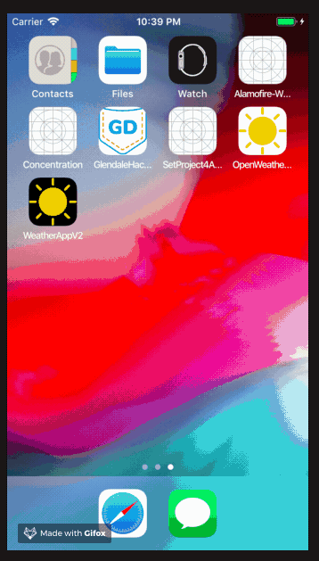

# OpenWeather iOS

Using a tutorial framework I have added dynamically changing weather icons, background depending on night or day, launch screen, custom icons and animation logic.

## Built With

* [Alamofire]() - HTTP Handler
* [SwiftyJSON]() - Simplifies JSON requests 
* [CocoaPods]() - Dependency Manager 

